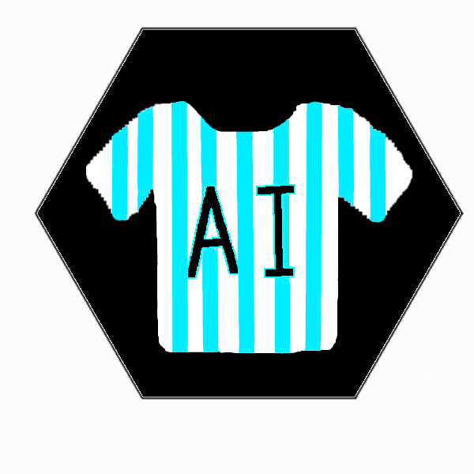
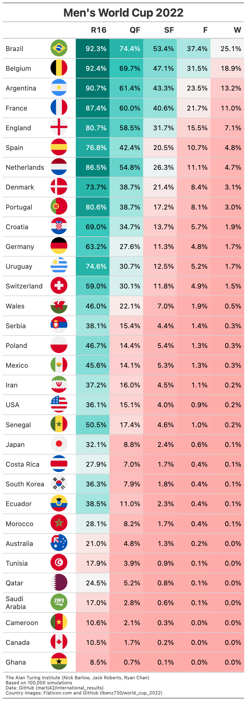
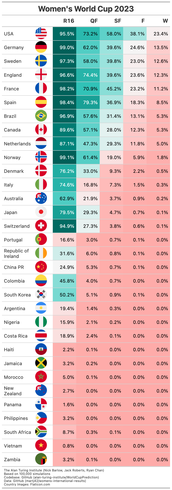

# WorldCupPrediction | AIrgentina



Predicting results for the **FIFA Men's 2022 World Cup** and **FIFA Women's 2023 World Cup**.

Matches are predicted using a framework based on the team-level model in [AIrsenal](https://github.com/alan-turing-institute/AIrsenal), a Python library for using Machine learning to pick a Fantasy Premier League team, which in turn uses [bpl](https://github.com/anguswilliams91/bpl-next) which is a [numpyro](https://num.pyro.ai/en/) implementation of our model.

This model is trained on international mens football results obtained from https://github.com/martj42/international_results and https://github.com/martj42/womens-international-results.

The original model is a version of [Dixon and Coles](https://rss.onlinelibrary.wiley.com/doi/10.1111/1467-9876.00065).

## In the media

There is some background information and description of the results [here](https://www.turing.ac.uk/blog/can-our-algorithm-predict-winner-2022-football-world-cup).

The **[New Scientist](https://www.newscientist.com/article/2347699-brazil-picked-as-2022-world-cup-winners-by-alan-turing-institute-model/)** also has an article, as does **The Daily Mail**, which prompted one reader to enthuse: *"What an absolute load of rubbish, but typical of the anti-English establishment today!"*, and another to ponder: *"I have NEVER KNOW a Prediction from a Scientist to be Right Ever, But on this Prediction  I may be wrong."*. High praise indeed!

Our model (AIrgentina) came 6th in [@Futbolmetrix1's WC2022 Sophisticated Prediction Contest](https://twitter.com/Futbolmetrix1/status/1604584845942087681) outperforming models developed by FiveThirtyEight, Opta and Betfair! 

## Installation

The easiest way to use the code is via [poetry](https://python-poetry.org/).  If you have poetry installed, from this directory, you can do

```bash
poetry shell
poetry install
```

to first open a shell in a virtual environment, and then install the dependencies and the `wcpredictor` package.

## Usage

### Simulating a tournament multiple times

There are a couple of command-line applications that can be run when the `wcpredictor` package is installed as described above.

In order to simulate the 2022 Men's World Cup $N$ times, you can do

```bash
wcpred_run_simulations --num_simulations N --tournament_year 2022 --training_data_start <YYYY-MM-DD> --training_data_end <YYYY-MM-DD> --resume_from=Group --output_csv <outputfilename>
```

For the 2023 Women's World Cup, you can run

```bash
wcpred_run_simulations --womens --num_simulations N --tournament_year 2023  --years_training_data 20 --resume_from=Group --output_csv <outputfilename>
```

Notice here, instead of passing in the training start and end dates, we can simply pass how many years of training data to look backwards in time for. You can use the `--resume_from` CLI argument to specify at what point to simulate the tournament from. 

The results, in the form of a table of how many times each team got to each stage of the competition, will be saved in the specified csv file.   At present, the allowed values for `tournament_year` are "2014", "2018", "2022" (the default) and "2023".

⚠️ **Warning:** ⚠️ The simulations can use ***a lot*** of memory. If you want to run more than around 250 simulationns we recommend checking the help (`wcpred_run_simulations --help`) and setting the `--num_thread` and `--per_tournament` arguments (start low andd then slowly increase them whilst monitoring CPU/memory usage on your system).

Once you have a csv file saved from running the simulation, you can plot the top ten most frequent winners by running:

```bash
wcpred_plot_winners --input_csv <inputfilename> --output_png <outputfilename>
```

and the results will be saved in the specified png.

You can also make a plot showing how far in the tournament a selection of teams got, by running e.g.:

```bash
wcpred_plot_progress --input_csv <inputfilename> --output_png <outputfilename> --team_list "England,Wales"
```

Note that both these commands can be run with `--help` to see the options.

### Running a single tournament

In a python session, to simulate the Men's 2022 World Cup, you can do something like:

```python
python
>>> from wcpredictor import Tournament, get_and_train_model
>>> t = Tournament("2022") # can also choose "2018" or "2014"
>>> model = get_and_train_model(start_date="2016-06-01", end_date="2022-11-20") # choose dates for training data
>>> t.play_group_stage(model)
>>> # at this stage, we can look at how each group is doing
>>> print(t.groups["A"])
Position |  Team   | Points | GS |  GA
   1st    Netherlands   6      8     4
   2nd    Qatar         4      2     1
   3rd    Ecuador       4      1     5
   4th    Senegal       3      4     5
>>> # or, we can go ahead and play the knockout stages
>>> t.play_knockout_stages(model)
>>> print(t.winner)
```

# Pre-tournament predictions:

## FIFA Men's 2022 World Cup


## FIFA Women's 2023 World Cup

